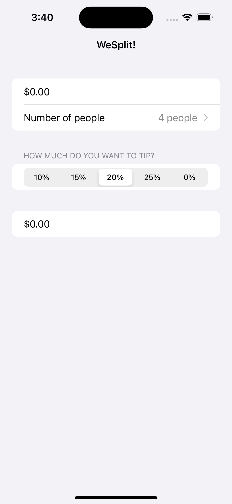
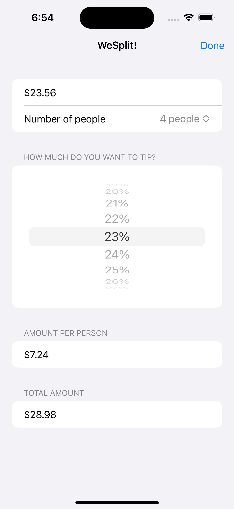

# Day 16 - 18: _Project 1: WeSplit_, Part One - Three


_Follow along at https://www.hackingwithswift.com/100/swiftui/16_.

# 📒 Notes
- Day one goes through Form, NavigationStack, @State, Buttons, Picker, and 
- Day two involved putting those items together to build out the WeSplit application
- Day three is review of the code that was just written 
- SwiftUI allows no more than 10 child views inside each parent
    - If you want more you should place your views inside groups
- The keyboardType() modifier lets us change the keyboard that is shown when a text field is active.
- All SwiftUI views must have a body property
- SwiftUI doesn't allow more than 10 hard-coded items inside a parent, but views created using ForEach don't count towards that limit
- Whenever an @State property changes, Swift re-invokes our body property
    - This behavior forces all values inside the body to be re-evaluated, making sure they are updated for the changes
- We can send a string to the navigationTitle() modifier to place a title at the top of our navigation view.
- All SwiftUI views must inherit from the View protocol

WeSplit Complete            |  WeSplit Addons
:-------------------------:|:-------------------------:
  |  


## Code snippets to remember

```swift
// below code goes inside of a ContentView
// it returns a NavigationStack view that has a title "SwiftUI" in the middle and a small "Hello, world!" section
    var body: some View {
        NavigationStack {
            Form {
                Section {
                    Text("Hello, world!")
                }
            }.navigationTitle("SwiftUI")
            .navigationBarTitleDisplayMode(.inline)
        }
    }
```

```swift
// @State properties
struct ContentView: View {
    @State var tapCount = 0 // @State allows us to modify properties without using the mutating

    var body: some View {
        Button("Tap count: \(tapCount)") {
            tapCount += 1 // action to be taken when the button is pressed
        }
    }
}
```

```swift
// code inside a ContentView
@State private var name = "" // Two way binding
    
var body: some View {
    Form {
        TextField("Enter your name", text: $name) // $property means it can be read and written
        Text("Hello, \(name)!")
    }
}
```

```swift
// 
let students = ["Harry", "Hermione", "Ron"]
@State private var selectedStudent = "Harry" // Two way binding

var body: some View {
    NavigationStack {
        Form {
            Picker("Select your student", selection: $selectedStudent) {
                ForEach(students, id: \.self) { // .self is needed to know how to identify each item
                    Text($0)
                }
            }
        }
    }
}
```

```swift
// Locale is a built in struct in iOs to read properties on a users device
TextField("Amount", value: $checkAmount, format: .currency(code: Locale.current.currency?.identifier ?? "USD"))
```

# 🔗 Additional related links
[Picker Apple Documentation](https://developer.apple.com/documentation/swiftui/picker)
[Navigation Stack Documentation](https://developer.apple.com/documentation/swiftui/navigationstack)
[TextField Documentation](https://developer.apple.com/documentation/swiftui/textfield)
[State Documentation](https://developer.apple.com/documentation/swiftui/state)
[ForEach Documentation](https://developer.apple.com/documentation/swiftui/foreach)
[FocusState Documentation](https://developer.apple.com/documentation/swiftui/focusstate)
[Section Documentation](https://developer.apple.com/documentation/swiftui/section)