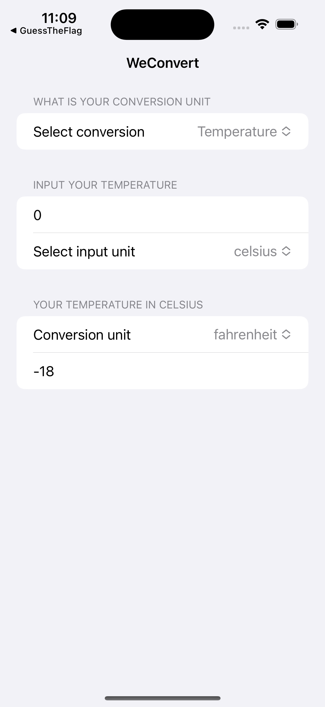

# Day 19: _Challenge 1: WeConvert


_Follow along at https://www.hackingwithswift.com/100/swiftui/19.

# 📒 Notes
- The challenge description is: build an app that handles unit conversions: users will select an input unit and an output unit, then enter a value, and see the output of the conversion.

WeConvert Complete            |
:-------------------------:|
  |


## 👨🏾‍💻 Code snippets to remember

```swift
// The picker code is something I'm still hazy on
Picker("Conversion unit", selection: $conversionUnit) {
    ForEach(possibleTemperatureConversion, id: \.self) {
        Text($0)
    }
    /*
    ForEach(0..<101) {
        Text($0, format: .number)
    }
    */
}
```

```swift
// I utilized a protocol in this challenge which allows for subbing in a different class for the conversion, aka going from temperature to length
protocol Converter {
    func convertInput(input: Int, fromUnit: String, toUnit: String) -> Int
}

struct TemperatureConverter: Converter {
    // Fahrenheit to celsius
    func convertInput(input: Int, fromUnit: String, toUnit: String) -> Int {
        // lots of switch conversion code
    }
}

struct ContentView: View {
    
    // other code

    let temperatureConverter = TemperatureConverter()

    func convertUserValue(_ converter: Converter) -> Int {
        converter.convertInput(input: userValue, fromUnit: currentUnit, toUnit: conversionUnit)
    }

    // other code

    Section("Your temperature in Celsius") {
        Text(convertUserValue(temperatureConverter), format: .number)
    }
}
```

# 🔗 Additional related links
