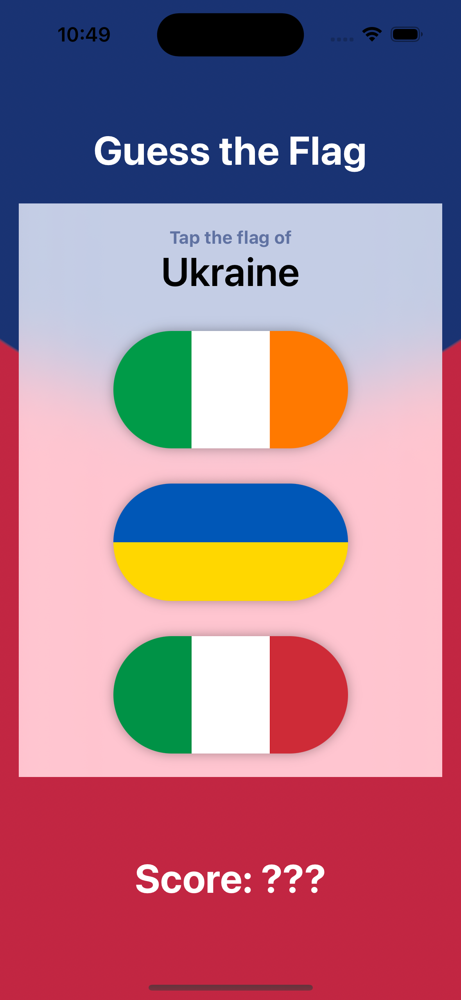
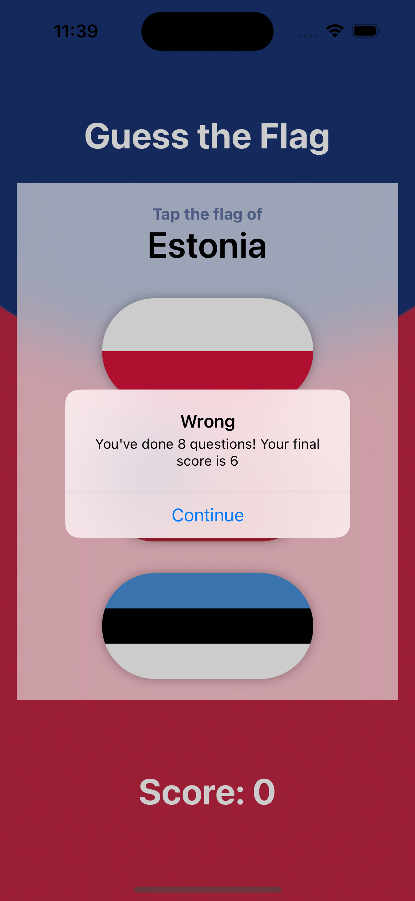

# Day 20-22: GuessThatFlag


_Follow along at https://www.hackingwithswift.com/100/swiftui/20.

# 📒 Notes
- This section involves learning VStack, HStack, ZStack, Spacers, etc. through working through a game project
- Color(), frames, gradients (angular, linear, radial), buttons, image, alerts
- Reminder that stacks have a limit of 10 views

GuessThatFlag Complete            |     GuessThatFlag Addons            |
:-------------------------:|:-------------:|
  | |


## 👨🏾‍💻 Code snippets to remember

```swift
// This
var body: some View {
    VStack {
        Text("I'm on top of the world")
        Text("Hello, world!")
    }
    .padding()
}
// is the same as this
var body: some View {
    Text("I'm on top of the world")
    Text("Hello, world!")
}
// because this is a simple design
```

```swift
// Samples of stacks
var body: some View {
    // HStack(spacing: 20) {} is also possible
    // ZStack(alignment: .top) {} 
    VStack(spacing: 20) { // spacing of each element
        Text("I'm on top of the world")
        Text("Hello, world!")
        Spacer()
    }
    VStack(alignment: (.leading | .center | .trailing)) {
        Text("I'm aligned differently")
        Text("Watch me lean to one side or the other")
    } 
}
```

```swift
// Samples of color
var body: some View {
    // HStack(spacing: 20) {} is also possible
    // ZStack(alignment: .top) {} 
    VStack(spacing: 20) { // spacing of each element
        // Color.red
        // Color(red: 1, green: 0.8, blue: 0)
        //      .frame(width: 200, height: 200)
        //      .frame(minWidth: 200, maxWidth: .infinity, maxHeight: 200)
        Text("I'm on top of the world")
        Text("Hello, world!")
        Spacer()
    }
    .background(.red)
    //.background
    //.ignoresSafeArea()
}
```

```swift
// material/primary color
var body: some View {
    ZStack { 
        VStack {
            Color.red
            Color.blue
        }
        Text("I'm on top of the world")
        .foregroundStyle(.secondary)
        .padding(50)
        .background(.ultraThinMaterial)
    }
    .ignoresSafeArea()
}
```

```swift
// gradient color
var body: some View {
    LinearGradient(colors: [.white, .black], startPoint: .top, endpoint: .bottom)
    LinearGradient(stops: [
        Gradient.Stop(color: .white, location: 0.45), 
        .init(color: .black, location: 0.55)], startPoint: .top, endpoint: .bottom)
    RadialGradient(colors: [.blue, .black], center: .center, startRadius: 20, endRadius: 200)
    AngularGradient(colors: 
    [.red, .yellow, .green, .blue, .purple, .red], center: .center)
    Text("My content here")
    .frame(maxWidth: .infinity. maxHeight: .infinity)
    .foreground(.white)
    .background(.indigo.gradient)
}
```

```swift
// button color
var body: some View {
    Button("Delete selection", role: .destructive, action: executeDelete)

    func executeDelete() {
        print("Now deleting...")
    }
    Vstack {
        Button("Button 1") { }
        .buttonStyle(.bordered)

        Button("Button 1", role: .destructive) { }
        .buttonStyle(.bordered)

        Button("Button 1") { }
        .buttonStyle(.borderedProminent)
        .tint(.indigo)

        Button("Button 1", role: .destructive) { }
        .buttonStyle(.borderedProminent)
    }

    // Custom button type
    Button {
        print("Button was tapped") // Method call goes here
    } label: {
        Text()
        .padding()
        .foreground()
        .background()
    }
}
```

```swift
// Image
var body: some View {
    //Image(decorative: "singapore")
    Image(systemName: "pencil.circle")
    .foregroundStyle(.red)
    .font(.largeTitle)
}
```

```swift
// Button + Image Combo
var body: some View {
    Button {
        print("Button was tapped") // Method call goes here
    } label: {
        Image(systemName: "pencil.circle")
    }

    // or for both text and pictures

    Button("edit", systemImage: "pencil") {
        print("Button was tapped")
    }

    Button {
        print("Button was tapped") // Method call goes here
    } label: {
        /*
            HStack {

                Image()
            }
        */
        Label("Edit", systemImage: "pencil")
        .padding()
        .foregroundStyle(.white)
        .background(.red)
    }
}
```

```swift
struct ContentView: View {
    @State private var showingAlert = false

    var body: some View {
        Button("Show alert") {
            showingAlert = true
        }
        .alert("Important message", isPresented: $showingAlert) {
            Button("OK") { }
            // Button("Delete", role: .destructive) {}
            // Button("Cancel", role. .cancel) { }
        } message: {
            Text("Please read this.")
        }
    }
}
```

# 🔗 Additional related links
