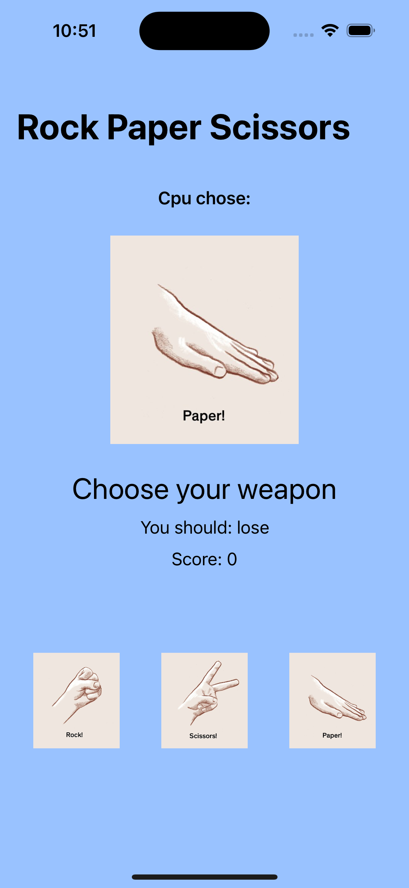

# Day _25: Review and Challenge


_Follow along at https://www.hackingwithswift.com/100/swiftui/25.

# 📒 Notes
- Below is a review of what has been covered so far just from reaching day 25:
- Building scrolling forms that mix text with controls such as Picker, which SwiftUI turns into a beautiful table-based layout where new screens slide in with fresh choices.
- Creating a NavigationStack and giving it a title. This not only allows us to push new views onto the screen, but also lets us set a title and avoid problems with content going under the clock.
- How to use @State to store changing data, and why it’s needed. Remember, all our SwiftUI views are structs, which means they can’t be changed without something like @State.
- Creating two-way bindings for user interface controls such as TextField and Picker, learning how using $variable lets us both read and write values.
- Using ForEach to create views in a loop, which allows us to make lots of views all at once.
- Building complex layouts using VStack, HStack, and ZStack, as well as combining them together to make grids.
- How to use colors and gradients as views, including how to give them specific frames so you can control their size.
- How to create buttons by providing some text or an image, along with a closure that should be executed when the button is tapped.
- Creating alerts by defining the conditions under which the alert should be shown, then toggling that state from elsewhere.
- How (and why!) SwiftUI uses opaque result types (some View) so extensively, and why this is so closely linked to modifier order being important.
- How to use the ternary conditional operator to create conditional modifiers that apply different results depending on your program state.
- How to break up your code into small parts using view composition and custom view modifiers, which in turn allows us to build more complex programs without getting lost in code.
- All Views we create in SwiftUI unwrap until they get down to primitive views like: Text, Image, Color, Spacer

Rock Paper Scissors Complete            |
:-------------------------:|
  |


## 👨🏾‍💻 Code snippets to remember

```swift
// This is not to remember for use, but more so to understand how @State works
struct ContentView: View {
    @State private var selection = 0

    var body: some View {
        let binding = Binding(
            // Using the setters and getters as a pass through to change the values from the methods the variable is bound to
            get: { selection },
            set: { selection = $0 }
        )

        return VStack {
            Picker("Select a number", selection: binding) {
                ForEach(0..<3) {
                    Text("Item \($0)")
                }
            }
            .pickerStyle(.segmented)
        }
    }
}
```

```swift
// 
@State var agreedToTerms = false
@State var agreedToPrivacyPolicy = false
@State var agreedToEmails = false

    var body: some View {
        let agreedToAll = Binding<Bool>(
            get: {
                agreedToTerms && agreedToPrivacyPolicy && agreedToEmails
            },
            set: {
                agreedToTerms = $0
                agreedToPrivacyPolicy = $0
                agreedToEmails = $0
            }
        )
        
        return VStack {
            Toggle("Agree to terms", isOn: $agreedToTerms)
            Toggle("Agree to privacy policy", isOn: $agreedToPrivacyPolicy)
            Toggle("Agree to receive shipping emails", isOn: $agreedToEmails)
            Toggle("Agree to all", isOn: agreedToAll)
        }
    }
```

```swift
// Some crucial code used for the project, that still needs some practice for me
Button("Words", action: someFunc)
Button{ 
    somFunc()
} label: {
    SomeView()
}
.alert("alertMessage", isPresent: bool) {
    Button("Ok", action: reset)
}
Color(red: 1.0, blue: 1.0, green: 1.0, opacity: 1.0)
```

# 🔗 Additional related links
